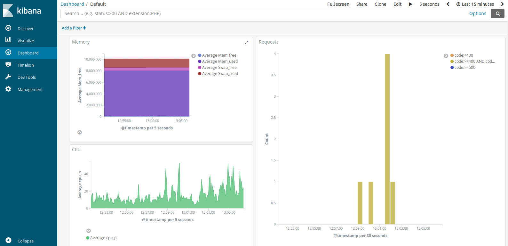

# Gerboise: data collection and visualisation in Kibana for Pôle Emploi Startups 

Gerboise is a project that allows app administrators to collect and visualise significant logs from their servers. It was designed to be really easy to setup; however, some familiarity with Kibana and Elasticsearch is required.

There are two parts of Gerboise that need to be configured and launched. First, there is the log storage server that runs Elasticsearch and Kibana. Nginx with basic authentication runs in front of Elasticsearch. It is quite possible to run many Elasticsearch/Kibana instances for many startups on just one server: ports should not conflict. Then, log collection must be run on the application servers.

All services on both servers are configured to run inside docker containers. Thus, [docker](https://docs.docker.com/engine/installation/) and [docker-compose install](https://docs.docker.com/compose/install/) need to be installed on all servers.

# Install

## Log storage and visualisation

Install system requirements (htpasswd and python):

    apt install apache2-utils python

Generate configuration files for your application:

    ./configure.py myapp

The application ID will be used to generate ports for all services. Thus, it needs to be unique to this application.

The configuration files will then be located in apps/myapp. 

Before starting elasticsearch, configure the system variable 'virtual memory maximum' with :
`sudo sysctl -w vm.max_map_count=262144` (temporary)
or add to configuration file /etc/sysctl.conf this : `vm.max_map_count=262144` (persistent)

Elasticsearch needs specifics access rights on directory myapp/data/elasticsearch/, execute this : chmod a+rwx data/elasticsearch

You can now run Nginx, Elasticsearch and Kibana with:

    cd apps/myapp
    docker-compose up

You should be able to open Kibana at http://localhost:56YOURAPPID. By default, Kibana comes with no dashboard or visualisation. You can import a few pre-configured dashboards and visualisation in Management 🠦  Saved Objects 🠦  Import 🠦  Select kibana.json. (NOTE: this might not work because you don't have the same index IDs, but it's worth trying)

## Log collection

Copy the `apps/myapp/docker-compose-fluentbit.yml` generated by the `configure.py myapp` command to your application servers. This is a docker-compose file that collects CPU stats, memory usage and nginx access logs and sends them to your Elasticsearch instance. To start collecting logs, just run:

    ES_PASSWORD=mypassword docker-compose -f docker-compose-fluentbit.yml up

# TODO 

- Let's encrypt certificates for nginx
- run curator periodically to clean ES indices
